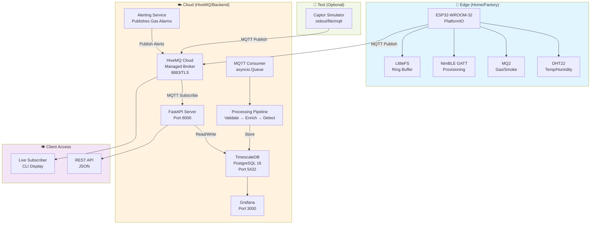

# ReTeqFusion IoT Telemetry Platform


### github : https://github.com/L3Bsghar-2-0/IDP/tree/dev

> End-to-end Industrial IoT sensor telemetry pipeline: collect multi-protocol sensor data on ESP32 edge devices, aggregate and validate in the cloud, detect anomalies in real time, and visualize via Grafana dashboards.

## 📋 Table of Contents

- [🎯 Purpose & Problem Statement](#-purpose--problem-statement)
- [🔍 What It Does](#-what-it-does)
- [🏗️ System Architecture](#-system-architecture)
- [🔩 Hardware](#-hardware)
- [🔌 Wiring & Cabling](#-wiring--cabling)
- [📁 Project Structure](#-project-structure)
- [⚙️ Technology Stack](#-technology-stack)
- [🔄 Workflow & Data Flow](#-workflow--data-flow)
- [🚀 Setup & Installation](#-setup--installation)
- [🛠️ Configuration Reference](#-configuration-reference)
- [🧪 Testing](#-testing)
- [📡 API & Interface Reference](#-api--interface-reference)
- [🚢 Deployment](#-deployment)
- [🗺️ Roadmap & Known Gaps](#-roadmap--known-gaps)
- [🤝 Contributing](#-contributing)
- [📜 License](#-license)

---

## 🎯 Purpose & Problem Statement

Industrial facilities require continuous, reliable monitoring of environmental sensors (temperature, humidity, gas/smoke levels) and operational devices (power consumption, vibration, energy usage) across distributed sites. Existing solutions are either proprietary and expensive or require manual infrastructure provisioning.

**ReTeqFusion solves this by providing:**
- A lightweight, deployable edge firmware stack for low-cost microcontrollers (ESP32)
- Automatic data aggregation, enrichment, and anomaly detection in a managed cloud backend
- Real-time visualization and alerting for facility operators
- Optional offline resilience (edge buffering, replay on reconnect)
- A complete simulation and testing environment for pipeline validation without hardware

---

## 🔍 What It Does

### From Operator's Perspective

1. **Deploy ESP32 devices** in facilities with DHT22 (temperature/humidity) and MQ2 (gas/smoke) sensors attached
2. **Provision WiFi credentials** via BLE or compile-time configuration
3. **Receive live telemetry** on a dashboard or in a terminal subscriber, updated every 2–5 seconds per sensor
4. **Get alerted** when gas levels spike, temperatures exceed safe ranges, or sensors drop offline
5. **Replay missing data** if the network goes down — edge devices buffer to LittleFS and replay on reconnect
6. **Test the entire pipeline** using the simulator without any hardware

### Technical Features

| Feature | Details |
|---------|---------|
| **Sensor sampling** | DHT22: 2s interval, MQ2: 5s aggregated (median-5 filter on 100ms samples) |
| **Network resilience** | LittleFS offline buffer (64 KB NDJSON ring), QoS 1 MQTT, exponential backoff reconnect |
| **Edge-to-cloud protocol** | TLS-secured MQTT over TCP (port 8883) to HiveMQ Cloud |
| **Data validation** | Pydantic models, range checking (DHT: -40…80°C, 0…100% RH; MQ2: configurable thresholds) |
| **Enrichment** | Heat index, dew point, comfort index (DHT22); hazard level, voltage ratio (MQ2) |
| **Anomaly detection** | Rising-edge smoke/hazard alarms, heat alerts (>60°C), dropout detection, range violations |
| **Cloud storage** | TimescaleDB (PostgreSQL 16 with TimescaleDB extension) for time-series telemetry, diagnostics, anomalies, gas alerts |
| **Visualization** | Pre-provisioned Grafana dashboards (datasource + dashboard JSON included) |
| **REST API** | FastAPI on port 8000 with 8 endpoints for device queries, history, anomalies, stats, DLQ inspection |
| **Diagnostics** | Per-device firmware reports (uptime, heap, RSSI, reset reason, error counters) every 5 minutes |

---

## 🏗️ System Architecture



**Data Flow Summary:**
1. **ESP32 device** samples sensors every 2–5s, validates locally, publishes JSON MQTT messages to HiveMQ Cloud on topics: `tenants/{TENANT}/sites/{SITE}/devices/{DEVICE_ID}/sensors/{SENSOR_TYPE}/telemetry`
2. **FastAPI server** (background MQTT thread + asyncio consumer) receives messages, deserializes with Pydantic, and enqueues for processing
3. **Processing Pipeline** validates readings, computes enrichments (heat index, hazard level), detects anomalies, and persists to TimescaleDB
4. **Alerting Service** watches for smoke/hazard/heat anomalies and publishes gas alarm messages back to MQTT
5. **REST API** exposes query endpoints for devices, sensors, history, anomalies, and stats
6. **Grafana** reads from TimescaleDB datasource and renders dashboards
7. **Live Subscriber** (CLI) connects directly to MQTT and renders real-time messages in terminal
8. **Simulator** (optional, for testing) generates realistic sensor data with failure injection and publishes via MQTT or files

---

## 🔩 Hardware

### Components

| Item | Model | Qty | Role | Notes |
|------|-------|-----|------|-------|
| **Microcontroller** | ESP32-WROOM-32 | 1 | Main compute | 240 MHz dual-core, WiFi 802.11b/g/n, BLE 5.0, 16 MB Flash, 8 MB PSRAM in devkit variant |
| **Temperature/Humidity Sensor** | DHT22 | 1 | Environmental monitoring | Range: -40…80°C, 0…100% RH, accuracy ±0.5°C / ±2%, I2C-like single-wire, 2s sampling interval |
| **Gas/Smoke Sensor** | MQ2 | 1 | Hazard detection | Analog output (0–4095 on 12-bit ADC), detects LPG, propane, methane, alcohol, smoke; requires 5V or 3.3V (see wiring) |
| **Decoupling Capacitors** | 100nF (C0G) | 2 | Power supply filtering | One near ESP32 VCC, one near sensor supply rail |
| **Pull-up Resistor** | 10 kΩ (1/4W carbon) | 1 | DHT22 DATA line | 3.3V rail to GPIO 4 |
| **USB-to-UART Adapter** | CP2102 or CH340 | 1 | Serial flashing | For firmware upload and serial monitoring (115200 baud) |

### Power Requirements

- **ESP32**: 3.3V @ ~80 mA typical (WiFi active ~250 mA peak)
- **DHT22**: 3.3V @ ~1 mA average
- **MQ2**: 5V @ ~150 mA average (heater), or 3.3V (reduced sensitivity)
- **Total on USB 5V supply**: ~500 mA sustainable for testing; for production, use a dedicated 5V PSU and regulate 3.3V via LDO

---

## 🔌 Wiring & Cabling

### Pin Mapping (ESP32-WROOM-32 dev board)

| Signal | ESP32 Pin | Notes |
|--------|-----------|-------|
| **DHT22 VCC** | 3.3V rail | Connect to +3.3V after LDO or directly from devkit 3V3 pin |
| **DHT22 DATA** | GPIO 4 | Single-wire protocol; 10 kΩ pull-up to 3.3V |
| **DHT22 GND** | GND | Common ground |
| **MQ2 VCC** | 5V rail | Use 5V USB supply or external PSU; see note below |
| **MQ2 GND** | GND | Common ground |
| **MQ2 AO (analog out)** | GPIO 34 (ADC1_CH6) | Input-only pin, 12-bit ADC (0–4095), attenuation set to 11dB for 0–3.3V range |

### Schematic Notes

**DHT22 Connection:**
```
3.3V ---|10k ohm|--- GPIO 4
                |
              DHT22 DATA
```
- The pull-up is **critical** for reliable operation.
- DHT22 operates on 3.3V; do not connect to 5V directly (will damage sensor).

**MQ2 Connection:**
```
5V (or 3.3V) --- MQ2 VCC
    GND       --- MQ2 GND
GPIO 34       --- MQ2 AO (analog output)
```
- MQ2 operates best on **5V**, which heats the sensor element for accurate readings.
- If using 3.3V directly (e.g., USB devkit), sensitivity is reduced by ~30%, but acceptable for testing.
- The ESP32 ADC is already configured for 11dB attenuation, which limits input to 0–3.3V. The firmware will read raw ADC values (0–4095) and convert to equivalent PPM via a calibration curve defined in `src/sensor_mq2.cpp`.

**Bus Topology:**
- Single-wire DHT22 is **point-to-point** (GPIO 4 only).
- MQ2 analog output is **single-channel** (GPIO 34 only).
- No I2C or SPI bus is used in the current firmware.
- No additional external devices (LCD, buzzer, relay) are wired, but the firmware architecture supports adding them to new GPIO pins without hardware changes (see `src/sensor_dht22.h` and `src/sensor_mq2.h` for the sensor abstraction layer).

---

## 📁 Project Structure

```
IDP/
├── README.md                          ← You are here: master overview
├── RUNBOOK.md                         ← Detailed setup + execution pipeline walkthrough
│
├── esp32-edge/                        ← ESP32 firmware source (PlatformIO)
│   ├── platformio.ini                 ← Build configuration, board (esp32dev), libs, compiler flags
│   ├── README.md                      ← Firmware-specific setup, BLE provisioning, OTA contract
│   ├── README_CHANGELOG.md            ← Firmware version history and known gaps
│   ├── src/
│   │   ├── main.cpp                   ← Setup + main event loop; orchestrates init sequence + watchdog
│   │   ├── config.h                   ← Compile-time config: pins, broker URL, credentials (PLACEHOLDERS), CA cert, OTA key
│   │   ├── config.local.h.example     ← Template for gitignored local overrides (credentials)
│   │   ├── netmgr.{h,cpp}             ← WiFi STA + NTP + NVS credential persistence
│   │   ├── mqttmgr.{h,cpp}            ← MQTT-over-TLS wrapper; publish + LWT + buffering
│   │   ├── blesvc.{h,cpp}             ← NimBLE GATT service for provisioning + live reads
│   │   ├── buffer.{h,cpp}             ← LittleFS NDJSON ring buffer (64 KB max)
│   │   ├── sensor_dht22.{h,cpp}       ← DHT22 driver; 2s sampling, CRC validation, range checking
│   │   ├── sensor_mq2.{h,cpp}         ← MQ2 driver; 100ms samples aggregated 5s, median filter, PPM calc
│   │   ├── diag.{h,cpp}               ← Diagnostics task; publishes heap/RSSI/uptime every 5m
│   │   ├── ota.{h,cpp}                ← OTA state machine (HMAC scaffolding, incomplete verification)
│   │
├── reteqfusion-server/                ← FastAPI backend + Docker stack
│   ├── Dockerfile                     ← Python 3.12-slim image, installs deps, runs uvicorn
│   ├── docker-compose.yml             ← 3 services: app (8000), timescaledb (5432), grafana (3000), healthchecks
│   ├── requirements.txt                ← Python deps: paho-mqtt, fastapi, uvicorn, pydantic, asyncpg, pytest
│   ├── .env.example                   ← Template for MQTT/DB/Grafana secrets
│   ├── .env                           ← Runtime secrets (gitignored, must be created from example)
│   │
│   ├── app/
│   │   ├── main.py                    ← FastAPI lifespan: starts MQTT client, consumer task, alerting service
│   │   ├── config.py                  ← Pydantic Settings; parses .env into typed config
│   │   │
│   │   ├── mqtt/
│   │   │   ├── client.py              ← paho-mqtt wrapper; thread → asyncio.Queue bridge; TLS + LWT
│   │   │   ├── handlers.py            ← MessageDispatcher; deserializes JSON + Pydantic validation
│   │   │   ├── topic_parser.py        ← Parses MQTT hierarchical topic into tenant/site/device/sensor
│   │   │   └── legacy_translator.py   ← (legacy payload format converter, if needed)
│   │   │
│   │   ├── processing/
│   │   │   ├── pipeline.py            ← ProcessingPipeline; orchestrates validate → enrich → detect → store → alert
│   │   │   ├── validator.py           ← Pydantic models; range checks, NaN detection, quality flags
│   │   │   ├── enricher.py            ← Computes heat index, dew point, comfort (DHT22); hazard level (MQ2)
│   │   │   └── anomaly.py             ← AnomalyDetector; detects spikes, drifts, thresholds, dropouts
│   │   │
│   │   ├── storage/
│   │   │   ├── database.py            ← asyncpg pool + connection wrapper
│   │   │   ├── migrations.py          ← Runs SQL migration files on startup
│   │   │   ├── telemetry_repo.py      ← Inserts telemetry, anomalies, diagnostics, gas alerts
│   │   │   ├── device_repo.py         ← Upserts device status + last_seen
│   │   │   └── dlq_repo.py            ← Stores parse/validation/handler errors
│   │   │
│   │   ├── models/
│   │   │   ├── telemetry.py           ← Pydantic model for DHT22/MQ2 telemetry schema
│   │   │   ├── status.py              ← Device online/offline + metadata
│   │   │   └── diagnostics.py         ← Firmware diagnostics schema
│   │   │
│   │   ├── api/
│   │   │   ├── router.py              ← Top-level router mounting all sub-routers
│   │   │   ├── health.py              ← GET /health (liveness probe)
│   │   │   ├── devices.py             ← GET /api/v1/devices, /api/v1/devices/{device_id}
│   │   │   ├── sensors.py             ← GET /api/v1/devices/{id}/sensors/{id}/latest|history
│   │   │   ├── events.py              ← GET /api/v1/anomalies|gas-alerts|dlq|stats
│   │   │   └── schemas.py             ← Response Pydantic models
│   │   │
│   │   ├── alerts/
│   │   │   └── alerting.py            ← AlertingService; detects and publishes gas alarms back to MQTT
│   │   │
│   │   └── logging_setup.py           ← Structured JSON logging configuration
│   │
│   ├── sql/
│   │   ├── 001_init.sql               ← Schema: telemetry (hypertable), dlq, device_status, anomalies (hypertable), gas_alerts (hypertable)
│   │   ├── 002_aggregates.sql         ← View definitions and aggregation policies
│   │   └── 003_retention.sql          ← Data retention policies (compression, chunk intervals)
│   │
│   ├── grafana/
│   │   ├── grafana.ini                ← Grafana config (dashboards path, provisioning)
│   │   └── provisioning/
│   │       ├── dashboards/
│   │       │   ├── dashboard.yaml     ← Dashboard provisioning config
│   │       │   └── iot_overview.json  ← Pre-built dashboard definition
│   │       └── datasources/
│   │           └── timescaledb.yaml   ← TimescaleDB datasource auto-provisioning
│   │
│   └── tests/
│       ├── conftest.py                ← pytest fixtures
│       ├── test_api.py                ← Smoke tests: router imports, paths exist
│       ├── test_pipeline.py           ← Validator + enricher + anomaly detector unit tests
│       └── test_models.py             ← Pydantic model validation tests
│
├── reteqfusion-live/                  ← CLI subscriber for live debugging
│   ├── README.md                      ← Setup, output format, topics subscribed, troubleshooting
│   ├── subscriber.py                  ← MQTT client → paho → parser → display loop
│   ├── parser.py                      ← JSON deserialize + Pydantic validation
│   ├── display.py                     ← ANSI-colored terminal rendering per message type
│   ├── stats.py                       ← In-memory counters + summary output
│   └── requirements.txt                ← paho-mqtt, pydantic
│
└── captor-simulator/                  ← Sensor simulator (test without hardware)
    ├── README.md                      ← Setup, modes (stdout/file/mqtt), telemetry contract, failure injection
    ├── simulator.py                   ← CLI entrypoint (dispatches to runner.main)
    ├── config.yaml                    ← Device definitions, sensor types, failure schedules
    ├── requirements.txt                ← paho-mqtt, pydantic, numpy, PyYAML, aiosqlite
    └── simulator/
        ├── __init__.py
        ├── base.py                    ← BaseSensor abstract class
        ├── sensors.py                 ← Concrete sensor types: Temperature, Power, CO2, Vibration, Energy
        ├── device.py                  ← Device state machine; manages sensors, failure state, time progression
        ├── runner.py                  ← Main loop; dispatches to stdout/file/mqtt mode handlers
        └── otasim.py                  ← (OTA update simulation stub)
```

**Key Responsibilities:**
- **esp32-edge/** — Low-level edge telemetry collection, network resilience, OTA updates, BLE provisioning
- **reteqfusion-server/** — Cloud-side aggregation, validation, enrichment, anomaly detection, REST API, Grafana integration
- **reteqfusion-live/** — Real-time visual debugging of MQTT stream (no database)
- **captor-simulator/** — Test-first development; validate pipeline without hardware; failure injection for resilience testing

---

## ⚙️ Technology Stack

### Firmware (ESP32 Edge)

| Component | Version | Purpose |
|-----------|---------|---------|
| **PlatformIO** | 6.7.x (espressif32 platform) | Build system, flashing, monitoring |
| **Arduino-ESP32** | 2.0.x | ESP32 hardware abstraction layer |
| **ArduinoJson** | 7.0.4 | Lightweight JSON serialization (MQTT payloads) |
| **PubSubClient** | 2.8 | MQTT client library |
| **DHT sensor library** | 1.4.6 | DHT22 driver (Adafruit) |
| **Adafruit Unified Sensor** | 1.1.14 | Sensor abstraction layer |
| **NimBLE-Arduino** | 1.4.1 | Bluetooth LE stack for provisioning |
| **TLS** | mbedTLS (built-in to Arduino-ESP32) | MQTT-over-TLS; root CA pinned to ISRG Root X1 |

**Build Flags:**
- `CORE_DEBUG_LEVEL=3` — verbose debug output on serial
- `MQTT_MAX_PACKET_SIZE=1024` — maximum MQTT message size
- `CONFIG_BT_NIMBLE_MAX_CONNECTIONS=2` — BLE concurrent connections

### Backend (FastAPI + TimescaleDB)

| Component | Version | Purpose |
|-----------|---------|---------|
| **Python** | 3.12 | Runtime language (slim Docker image) |
| **FastAPI** | 0.115.0 | REST API framework |
| **Uvicorn** | 0.30.0 | ASGI server |
| **Pydantic** | 2.7.0 | Data validation + serialization |
| **pydantic-settings** | 2.3.0 | Environment config loading |
| **paho-mqtt** | 2.1.0 | MQTT client (CallbackAPIVersion v2) |
| **asyncpg** | 0.29.0 | PostgreSQL async driver |
| **PostgreSQL + TimescaleDB** | 16 (timescale/timescaledb:latest-pg16) | Time-series database |
| **Grafana** | latest | Data visualization |
| **pytest** | 8.2.0 | Test framework |

### Live Subscriber (CLI)

| Component | Version | Purpose |
|-----------|---------|---------|
| **Python** | 3.11+ | Runtime language |
| **paho-mqtt** | >=2.1.0 | MQTT client |
| **Pydantic** | >=2.7.0 | Payload validation |

### Simulator (Test)

| Component | Version | Purpose |
|-----------|---------|---------|
| **Python** | 3.11+ | Runtime language |
| **paho-mqtt** | >=1.6.1 | MQTT publishing |
| **Pydantic** | >=2.7.0 | Telemetry schema |
| **NumPy** | >=1.26.0 | Sensor simulation math |
| **PyYAML** | >=6.0.1 | Config file parsing |
| **aiosqlite** | >=0.20.0 | Async SQLite (offline buffer) |

### Network Services

| Service | Host | Port | Protocol | Role |
|---------|------|------|----------|------|
| **HiveMQ Cloud** | e9a3ce30ae3749ab880436548931b5d0.s1.eu.hivemq.cloud | 8883 | MQTT-over-TLS | Managed broker (authentication: username/password) |
| **FastAPI Server** | localhost (or 0.0.0.0 in Docker) | 8000 | HTTP | REST API |
| **TimescaleDB** | localhost/timescaledb (Docker service name) | 5432 | PostgreSQL | Time-series storage |
| **Grafana** | localhost | 3000 | HTTP | Dashboard visualization |

---

## 🔄 Workflow & Data Flow

### Data Path (End-to-End)

```
1. [ESP32 Device] ← sample DHT22/MQ2 every 2–5 seconds
2. [Validate locally] ← range checks, CRC, quality flags
3. [Publish to MQTT] ← tenants/{TENANT}/sites/{SITE}/devices/{DEVICE_ID}/sensors/{TYPE}/telemetry
4. [HiveMQ Cloud] ← broker forwards to all subscribers (QoS 1)
5. [FastAPI server] ← paho-mqtt client receives in background thread
6. [asyncio.Queue] ← message enqueued (thread-safe bridge)
7. [MQTT consumer coroutine] ← MessageDispatcher deserializes topic + JSON payload
8. [Pydantic validation] ← checks schema, types, ranges; on error → DLQ
9. [ProcessingPipeline] ← orchestrates enrichment, anomaly detection
10. [Enrichment] ← compute heat index, dew point, comfort (DHT22); hazard level, voltage ratio (MQ2)
11. [AnomalyDetector] ← detect smoke/hazard alarms, heat alerts, dropouts, spikes
12. [TimescaleDB insert] ← persist telemetry row + enrichments + anomalies
13. [Alerting service] ← if gas alarm detected, publish to MQTT gas alert topic
14. [Grafana dashboard] ← reads TimescaleDB datasource; renders real-time charts
15. [REST API] ← expose endpoints for device queries, history, anomalies, stats
16. [Live subscriber] ← optional CLI reads MQTT directly; renders in terminal
```

### Startup Sequence (Firmware)

1. Serial port initialized @ 115200 baud
2. `buffer::begin()` → LittleFS mounted (or created on first boot)
3. `dht22::begin()` → GPIO 4 initialized
4. `mq2::begin()` → GPIO 34 ADC initialized
5. `blesvc::begin()` → NimBLE advertising started
6. `netmgr::begin()` → WiFi STA mode connects (up to 20s wait, non-blocking)
7. `netmgr::waitForNtp()` → NTP sync (required for TLS certificate validation)
8. `mqttmgr::begin()` → MQTT client initialized; first connect attempted in main loop
9. `ota::begin()` → OTA state machine initialized
10. `diag::begin()` → Diagnostics scheduler activated
11. `esp_task_wdt_init()` → Task watchdog armed (30s timeout; reboot if main loop stalls)
12. Main loop starts → continuous tick of all subsystems

### MQTT Topic Hierarchy

**Inbound (from devices):**
```
tenants/{TENANT}/sites/{SITE}/devices/{DEVICE_ID}/sensors/{SENSOR_TYPE}/telemetry
tenants/{TENANT}/sites/{SITE}/devices/{DEVICE_ID}/status                          (retained, LWT)
tenants/{TENANT}/sites/{SITE}/devices/{DEVICE_ID}/diagnostics
```

**Outbound (from server alerts):**
```
tenants/{TENANT}/sites/{SITE}/alerts/{DEVICE_ID}/gas_alarm                        (when smoke/hazard detected)
servers/{SERVER_CLIENT_ID}/status                                                  (retained, LWT)
```

**Server subscriptions (QoS 1):**
```
tenants/+/sites/+/devices/+/sensors/dht22/telemetry
tenants/+/sites/+/devices/+/sensors/mq2/telemetry
tenants/+/sites/+/devices/+/status
tenants/+/sites/+/devices/+/diagnostics
```

**Live subscriber subscriptions (QoS 1):**
```
tenants/+/sites/+/devices/+/sensors/dht22/telemetry
tenants/+/sites/+/devices/+/sensors/mq2/telemetry
tenants/+/sites/+/devices/+/status
tenants/+/sites/+/devices/+/diagnostics
tenants/+/sites/+/devices/+/alerts/#                                              (all alerts)
```

---

## 🚀 Setup & Installation

### Prerequisites

**Hardware:**
- ESP32-WROOM-32 development board
- DHT22 sensor module
- MQ2 gas sensor module
- USB-to-UART adapter (CP2102 or CH340)
- 10 kΩ resistor (DHT22 pull-up)
- Jumper wires + breadboard
- 5V power supply (for MQ2 heater) or USB power

**Software & Accounts:**
- **Windows/macOS/Linux** with Python 3.11+
- **Docker Desktop** ≥ 4.30 (for backend stack) or Docker Engine + Compose v2
- **Git** for version control
- **PlatformIO Core** or VS Code + PlatformIO extension for firmware builds
- **HiveMQ Cloud** account (Free tier sufficient; sign up at https://console.hivemq.cloud/)
- **mosquitto-clients** (optional, for manual MQTT testing)

### Step 1: Clone & Explore

```powershell
# On Windows PowerShell
git clone <your-repo-url> C:\IDP
cd C:\IDP
git branch -a  # confirm you're on the active branch (e.g., main or esp32)
```

### Step 2: Prepare the Backend (.env File)

The backend stack requires runtime secrets in `.env`. Create it from the template:

```powershell
cd reteqfusion-server
Copy-Item .env.example .env
```

Edit `.env` with your actual broker and database credentials:

```dotenv
# MQTT (HiveMQ Cloud)
MQTT_HOST=e9a3ce30ae3749ab880436548931b5d0.s1.eu.hivemq.cloud
MQTT_PORT=8883
MQTT_USERNAME=python-server
MQTT_PASSWORD=<your-hivemq-password>
MQTT_CLIENT_ID=reteqfusion-server-01
MQTT_TLS=true
MQTT_KEEPALIVE=60

# Database (TimescaleDB in Docker)
POSTGRES_HOST=timescaledb
POSTGRES_PORT=5432
POSTGRES_DB=reteqfusion
POSTGRES_USER=reteq
POSTGRES_PASSWORD=<rotate-for-production>
DATABASE_URL=postgresql://reteq:<password>@timescaledb:5432/reteqfusion

# Grafana
GRAFANA_ADMIN_PASSWORD=<rotate-for-production>

# App
LOG_LEVEL=INFO
API_PORT=8000

# MQ-2 thresholds (ppm)
MQ2_SMOKE_ALARM_PPM=1000
MQ2_HAZARD_PPM=3000
```

> ⚠️ **WARNING — Secret Rotation:** If you change `POSTGRES_PASSWORD`, you must also update the embedded password in `DATABASE_URL`. The string is parsed by asyncpg, not recombined.

### Step 3: Start Backend Stack (Docker)

```bash
cd reteqfusion-server
docker compose up -d
```

**Verify services are running:**
```bash
docker compose ps
# Expected: 3 services in "running" state:
# - reteqfusion-app     (port 8000)
# - reteqfusion-timescaledb (port 5432)
# - reteqfusion-grafana (port 3000)
```

**Check health:**
```bash
curl http://localhost:8000/health
# Expected: HTTP 200 OK
```

**Access Grafana:**
```
http://localhost:3000
Username: admin
Password: <GRAFANA_ADMIN_PASSWORD from .env>
```

### Step 4: Build & Flash Firmware

**Option A: PlatformIO CLI**

```bash
cd esp32-edge

# Compile
pio run

# Flash (replace /dev/ttyUSB0 or COM3 with your serial port)
pio run -t upload

# Monitor serial output (115200 baud)
pio device monitor
```

**Option B: VS Code + PlatformIO Extension**

1. Open the `esp32-edge` folder in VS Code
2. PlatformIO should auto-detect the project
3. Click **"Upload"** in the status bar
4. Click **"Serial Monitor"** to view output

**Expected output on successful boot:**
```
================================================
  ESP32 IDP Edge Firmware  v1.0.0
================================================

>>> CLIENT_ID = esp32-a4cf12345678 <<<

[BUF] LittleFS mounted, current buffer = 0 bytes
[DHT22] init on GPIO 4
[MQ2] init on GPIO 34 (12-bit ADC)
[BLE] advertising as 'IDP-345678'
[NET] using compile-time credentials (ssid=MyWifi)
[NET] connecting to 'MyWifi'...
[NET] connected: ip=192.168.1.42 rssi=-54
[NTP] synced: 2026-05-02 14:23:11 UTC
[MQTT] init host=e9a3ce30ae3749ab880436548931b5d0.s1.eu.hivemq.cloud:8883
[DIAG] last reset reason: poweron

[MAIN] setup complete — entering main loop

[MQTT] connecting...
[MQTT] connected
[MQTT] published 'online' status
[BUF] drain complete — sent=0 kept=0 dropped=0
```

Then you should see one DHT22 telemetry every 2s and one MQ2 aggregation every 5s.

### Step 5: Verify End-to-End

**Option A: Live Subscriber (Real-time CLI)**

```bash
cd ../reteqfusion-live
pip install -r requirements.txt
python subscriber.py
```

You should see MQTT messages rendered in real time:
```
🌡 DHT22 Telemetry │ temp=24.5°C humidity=62% (quality: good)
💨 MQ-2 Gas Sensor │ ppm=412 hazard=safe smoke_detected=0
📡 Device Status   │ online rssi=-54 ip=192.168.1.42
...
📊 Stats │ Msgs: 142 │ DHT22: 71 │ MQ2: 69 │ Alerts: 0 │ Uptime: 00:03:22
```

**Option B: REST API (via curl or browser)**

```bash
curl http://localhost:8000/api/v1/devices
curl http://localhost:8000/api/v1/devices/esp32-a4cf12345678/sensors/dht22_01/latest
curl http://localhost:8000/api/v1/stats
```

**Option C: Grafana Dashboard**

1. Navigate to http://localhost:3000
2. Log in with admin / `<GRAFANA_ADMIN_PASSWORD>`
3. Go to **Dashboards** → **IoT Overview** (pre-provisioned)
4. You should see real-time telemetry charts and device status

---

## 🛠️ Configuration Reference

### Firmware Configuration (esp32-edge/src/config.h)

| Variable | Type | Default | Purpose |
|----------|------|---------|---------|
| `WIFI_SSID` | string | `"MyWifi"` | WiFi SSID (set compile-time or via NVS/BLE provisioning) |
| `WIFI_PASSWORD` | string | `"password"` | WiFi password (set compile-time or via NVS/BLE provisioning) |
| `MQTT_HOST` | string | `e9a3ce...` | HiveMQ Cloud hostname |
| `MQTT_PORT` | int | `8883` | MQTT port (TLS) |
| `MQTT_USERNAME` | string | `PLACEHOLDER_...` | Device MQTT credential (user) |
| `MQTT_PASSWORD` | string | `PLACEHOLDER_...` | Device MQTT credential (password) |
| `TENANT` | string | `"demo"` | Tenant ID (part of topic hierarchy) |
| `SITE` | string | `"lab"` | Site ID (part of topic hierarchy) |
| `DHT22_PIN` | int | `4` | GPIO pin for DHT22 DATA line |
| `MQ2_ADC_PIN` | int | `34` | GPIO pin for MQ2 analog output |
| `DHT22_SAMPLE_INTERVAL_MS` | int | `2000` | DHT22 read interval (2 seconds) |
| `MQ2_SAMPLE_INTERVAL_MS` | int | `100` | MQ2 ADC read interval (100 ms) |
| `MQ2_AGGREGATION_WINDOW_MS` | int | `5000` | MQ2 aggregation window (5 seconds) |
| `OTA_POLLING_INTERVAL_SECONDS` | int | `3600` | HTTP polling interval (1 hour) |
| `OTA_ROLLBACK_BOOT_THRESHOLD` | int | `3` | Boot failures before rollback |
| `OTA_SIGNATURE_KEY` | string | `<hex>` | 32-char hex HMAC-SHA256 key (device-side) |
| `CA_CERT` | string | `PEM block` | ISRG Root X1 certificate (MQTT TLS) |

**To override at runtime:**

Create `src/config.local.h` (gitignored) with your settings:
```cpp
#pragma once

#undef WIFI_SSID
#define WIFI_SSID "MyRealWifi"

#undef WIFI_PASSWORD
#define WIFI_PASSWORD "MyRealPassword"

#undef MQTT_USERNAME
#define MQTT_USERNAME "device-user"

#undef MQTT_PASSWORD
#define MQTT_PASSWORD "device-pass"
```

Then include it at the top of `config.h`:
```cpp
#include "config.local.h"  // optional override
```

### Backend Configuration (reteqfusion-server/.env)

| Variable | Type | Default | Purpose |
|----------|------|---------|---------|
| `MQTT_HOST` | string | `localhost` | MQTT broker hostname |
| `MQTT_PORT` | int | `8883` | MQTT broker port |
| `MQTT_USERNAME` | string | `python-server` | Server's MQTT credential (user) |
| `MQTT_PASSWORD` | string | `` | Server's MQTT credential (password) |
| `MQTT_CLIENT_ID` | string | `reteqfusion-server-01` | MQTT client ID (for broker LWT) |
| `MQTT_TLS` | bool | `true` | Enable TLS for MQTT |
| `MQTT_KEEPALIVE` | int | `60` | MQTT keepalive (seconds) |
| `POSTGRES_HOST` | string | `timescaledb` | Database hostname |
| `POSTGRES_PORT` | int | `5432` | Database port |
| `POSTGRES_DB` | string | `reteqfusion` | Database name |
| `POSTGRES_USER` | string | `reteq` | Database user |
| `POSTGRES_PASSWORD` | string | `` | Database password |
| `DATABASE_URL` | string | `` | Full PostgreSQL connection string (asyncpg format) |
| `GRAFANA_ADMIN_PASSWORD` | string | `` | Grafana admin password |
| `LOG_LEVEL` | string | `INFO` | Logging level (DEBUG, INFO, WARNING, ERROR) |
| `API_PORT` | int | `8000` | FastAPI server port |
| `MQ2_SMOKE_ALARM_PPM` | int | `1000` | MQ2 smoke threshold (ppm) |
| `MQ2_HAZARD_PPM` | int | `3000` | MQ2 hazard threshold (ppm) |
| `ALERT_TENANT` | string | `demo` | Server's tenant for alert publishing |
| `ALERT_SITE` | string | `lab` | Server's site for alert publishing |

---

## 🧪 Testing

### Unit Tests (Server)

```bash
cd reteqfusion-server

# Run all tests
pytest

# Run specific test file
pytest tests/test_pipeline.py -v

# Run with coverage
pytest --cov=app --cov-report=html
```

**Test Coverage:**

| Module | Tests | Coverage |
|--------|-------|----------|
| **API routes** | Import smoke tests; verifies paths exist | `/health`, `/devices`, `/sensors/{id}/latest|history`, `/anomalies`, `/gas-alerts`, `/dlq`, `/stats` |
| **Validator** | Range checks, NaN handling, quality flags | DHT22 in/out of range, MQ2 boolean validation, gas PPM bounds |
| **Enricher** | Heat index, dew point, comfort index, hazard level | Known values, threshold crossings |
| **Anomaly Detector** | Smoke/hazard alarms, heat alerts, dropout detection | Rising-edge detection, state machine, threshold logic |

**Known Test Gaps:**
- ⚠️ No live database fixtures (tests do not spin up a real TimescaleDB instance)
- ⚠️ No MQTT mock tests (paho-mqtt client not mocked; integration tests only)
- ⚠️ No end-to-end pipeline tests with real MQTT + DB

### Integration Test (Simulator → Backend)

```bash
# Terminal 1: Start backend
cd reteqfusion-server
docker compose up -d
sleep 5  # wait for services to be healthy

# Terminal 2: Start simulator in MQTT mode
cd captor-simulator
export MQTT_HOST=localhost
export MQTT_PORT=8883
export MQTT_USER=simulator
export MQTT_PASS=simulator-password
python simulator.py --mode mqtt --config config.yaml

# Terminal 3: Verify data in database
docker exec -it reteqfusion-timescaledb psql -U reteq -d reteqfusion -c "SELECT * FROM telemetry ORDER BY time DESC LIMIT 5;"

# Terminal 4: Live subscriber
cd ../reteqfusion-live
python subscriber.py
```

### End-to-End Test (Hardware → Cloud → UI)

1. Flash ESP32 with real WiFi credentials and HiveMQ Cloud broker details
2. Power on and wait for MQTT connect (serial output confirms)
3. Start live subscriber to see real-time telemetry
4. Open Grafana dashboard to verify charting
5. Trigger a gas alarm manually (blow-dry to MQ2 sensor) and verify alert is published

---

## 📡 API & Interface Reference

### REST API (FastAPI, port 8000)

**Base URL:** `http://localhost:8000`

| Method | Path | Response | Example |
|--------|------|----------|---------|
| `GET` | `/health` | `{"status": "ok"}` | `curl http://localhost:8000/health` |
| `GET` | `/api/v1/devices` | Array of `DeviceSummary` | List all devices online |
| `GET` | `/api/v1/devices/{device_id}` | `DeviceDetail` + latest readings | Get single device + latest sensor values |
| `GET` | `/api/v1/devices/{device_id}/sensors/{sensor_id}/latest` | Array of `SensorReading` | Latest reading for each reading key (temp, humidity, etc.) |
| `GET` | `/api/v1/devices/{device_id}/sensors/{sensor_id}/history?from=2026-05-01T00:00:00Z&to=2026-05-02T00:00:00Z&resolution=raw\|1min\|1hour` | Array of `HistoryPoint` | Time-series telemetry with optional aggregation |
| `GET` | `/api/v1/anomalies?device_id=X&sensor_type=dht22\|mq2&type=SMOKE_ALARM\|HEAT_ALERT\|...&from=X&to=X&limit=200` | Array of `AnomalyEvent` | Detected anomalies |
| `GET` | `/api/v1/gas-alerts?limit=100` | Array of `GasAlertEvent` | MQ2 smoke/hazard alarm events |
| `GET` | `/api/v1/dlq?limit=50` | Array of `DlqEntry` | Parse/validation/handler errors (dead-letter queue) |
| `GET` | `/api/v1/stats` | `StatsResponse` | Daily counters: total messages, anomaly count, devices online, avg temperature, etc. |

**Response Models (defined in `app/api/schemas.py`):**

```python
# DeviceSummary
{
  "device_id": "esp32-a4cf12345678",
  "status": "online",
  "last_seen": "2026-05-02T14:23:45.000Z",
  "sensor_types": ["dht22", "mq2"],
  "rssi": -54,
  "fw_version": "1.0.0"
}

# SensorReading
{
  "reading_key": "temperature",
  "value": 24.5,
  "unit": "C",
  "quality": "good",
  "ts": "2026-05-02T14:23:45.000Z"
}

# HistoryPoint
{
  "ts": "2026-05-02T14:23:45.000Z",
  "value": 24.5,
  "unit": "C",
  "quality": "good"
}

# AnomalyEvent
{
  "ts": "2026-05-02T14:23:45.000Z",
  "device_id": "esp32-a4cf12345678",
  "sensor_id": "mq2_01",
  "sensor_type": "mq2",
  "anomaly_type": "SMOKE_ALARM",
  "confidence": 0.95,
  "description": "Smoke detected above 1000 ppm threshold",
  "reading_value": 1500
}

# StatsResponse
{
  "total_messages": 15420,
  "anomaly_count": 23,
  "gas_alerts": 2,
  "devices_online": 4,
  "dlq_count": 1,
  "avg_temperature_1h": 24.3
}
```

### MQTT Topics (HiveMQ Cloud)

**Topic Pattern:** `tenants/{TENANT}/sites/{SITE}/devices/{DEVICE_ID}/...`

**Inbound (to server):**

```
tenants/demo/sites/lab/devices/esp32-a4cf12345678/sensors/dht22/telemetry
```
Payload:
```json
{
  "schema_version": "1.0",
  "ts": "2026-05-02T14:23:45.000Z",
  "device_id": "esp32-a4cf12345678",
  "tenant": "demo",
  "site": "lab",
  "sensor_id": "dht22_01",
  "sensor_type": "dht22",
  "seq": 12345,
  "readings": {
    "temperature": {
      "value": 24.5,
      "unit": "C",
      "quality": "good"
    },
    "humidity": {
      "value": 62.0,
      "unit": "%",
      "quality": "good"
    }
  },
  "fw_version": "1.0.0"
}
```

```
tenants/demo/sites/lab/devices/esp32-a4cf12345678/sensors/mq2/telemetry
```
Payload:
```json
{
  "schema_version": "1.0",
  "ts": "2026-05-02T14:23:50.000Z",
  "device_id": "esp32-a4cf12345678",
  "tenant": "demo",
  "site": "lab",
  "sensor_id": "mq2_01",
  "sensor_type": "mq2",
  "seq": 12346,
  "readings": {
    "raw_adc": {"value": 890, "unit": "adc", "quality": "good"},
    "voltage": {"value": 0.72, "unit": "V", "quality": "good"},
    "rs_r0_ratio": {"value": 3.21, "unit": "", "quality": "good"},
    "gas_ppm": {"value": 412, "unit": "ppm", "quality": "good"},
    "smoke_detected": {"value": 0, "unit": "bool", "quality": "good"}
  },
  "fw_version": "1.0.0"
}
```

```
tenants/demo/sites/lab/devices/esp32-a4cf12345678/status
```
Payload (retained):
```json
{
  "status": "online",
  "device_id": "esp32-a4cf12345678",
  "ip": "192.168.1.42",
  "rssi": -54,
  "fw_version": "1.0.0"
}
```

```
tenants/demo/sites/lab/devices/esp32-a4cf12345678/diagnostics
```
Payload:
```json
{
  "device_id": "esp32-a4cf12345678",
  "ts": "2026-05-02T14:25:00.000Z",
  "uptime_s": 350,
  "free_heap": 145920,
  "wifi_rssi": -54,
  "mqtt_reconnects": 0,
  "dlq_buffered": 0
}
```

**Outbound (from server):**

```
tenants/demo/sites/lab/alerts/esp32-a4cf12345678/gas_alarm
```
Payload:
```json
{
  "type": "GAS_ALARM",
  "level": "SMOKE",
  "ppm": 1500,
  "ts": "2026-05-02T14:23:45.000Z",
  "device_id": "esp32-a4cf12345678",
  "sensor_id": "mq2_01"
}
```

### CLI Subscriber Output

The live subscriber (`reteqfusion-live/subscriber.py`) renders MQTT messages to the terminal with color and emoji:

```
🌡 DHT22 Telemetry
  temp: 24.5°C (good) | humidity: 62.0% (good)

💨 MQ-2 Gas Sensor
  raw_adc: 890 adc | voltage: 0.72 V | rs_r0_ratio: 3.21
  gas_ppm: 412 ppm (good) | smoke_detected: 0 (no)
  [████████████████░░░░░░░░░░░░] 25% of 4095 ADC

📡 Device Status
  ✅ online | ip: 192.168.1.42 | rssi: -54 | fw_version: 1.0.0

🚨 MQ-2 GAS ALARM ⚠️ ⚠️ ⚠️
  SMOKE | 1500 ppm | device: esp32-a4cf12345678 | sensor: mq2_01

📊 Stats │ Msgs: 142 │ DHT22: 71 │ MQ2: 69 │ Alerts: 2 │ Errors: 0 │ Uptime: 00:03:22
```

---

## 🚢 Deployment

### Development (Docker Compose)

```bash
cd reteqfusion-server
docker compose up -d
```

Services start on:
- **API:** http://localhost:8000
- **Grafana:** http://localhost:3000
- **TimescaleDB:** localhost:5432 (internal)

### Production Considerations

**Security:**
- ✅ All passwords in `.env` must be rotated before deployment
- ✅ MQTT uses TLS with certificate pinning (ISRG Root X1)
- ✅ Database password embedded in `DATABASE_URL`; protect with secrets manager (AWS Secrets Manager, HashiCorp Vault, etc.)
- ✅ Grafana password set in `GRAFANA_ADMIN_PASSWORD`

**Scaling:**
- ✅ FastAPI is async and handles concurrent connections efficiently
- ✅ asyncpg connection pooling (default 10 connections) is tunable via `DATABASE_URL` query params
- ✅ TimescaleDB hypertable compression is configured in `sql/003_retention.sql` (7-day retention before compression)
- ✅ Grafana auto-provisioning requires persistent volumes (`grafana_data`)

**Monitoring:**
- ✅ Server publishes LWT status to `servers/{CLIENT_ID}/status` (retained)
- ✅ Device status tracked in `device_status` table (last_seen, online/offline flag)
- ✅ Failed messages routed to DLQ table for inspection and replay
- ✅ Structured JSON logging to stdout (capture with Docker logs)

### Firmware Deployment

**First Flash (or Full Rebuild):**
```bash
cd esp32-edge
pio run -t erase_flash  # optional: reset all flash
pio run -t upload       # compile + flash
pio device monitor      # verify boot output
```

**OTA Update (planned):**
> ⚠️ OTA is currently experimental. HMAC signature verification is incomplete. See [Roadmap](#-roadmap--known-gaps).

The firmware supports OTA updates via:
1. **HTTP polling** — device fetches from a URL every hour (configurable)
2. **MQTT push command** (unimplemented; see roadmap)

Expected push command payload:
```json
{
  "url": "https://example.com/firmware/esp32-edge-1.2.0.bin",
  "version": "1.2.0",
  "signature": "<hex-encoded-hmac-sha256>",
  "chunk_size": 4096
}
```

---

## 🗺️ Roadmap & Known Gaps

### Documented TODOs

From [esp32-edge/README.md](esp32-edge/README.md) and [esp32-edge/README_CHANGELOG.md](esp32-edge/README_CHANGELOG.md):

**Firmware (esp32-edge/):**

1. **MQTT command subscription wiring** — The codebase scaffolds `ota::onUpdateCommand()` but does not wire MQTT subscriptions to route incoming command messages to it. The firmware currently only supports HTTP polling for OTA, not push commands.
   - **Impact:** Production deployments cannot push OTA updates remotely; only polling is available.
   - **Next step:** Implement `mqttmgr::setCallback()` and subscribe to `tenants/{TENANT}/sites/{SITE}/devices/{DEVICE_ID}/commands/ota/update`; route payloads to OTA handler.

2. **Incomplete OTA HMAC verification** — `ota.cpp` contains `initHmac()` and `verifySignature()` scaffolding, but full `mbedtls_md_hmac()` verification is not implemented. Binary integrity on update is currently **not guaranteed**.
   - **Impact:** OTA updates may apply corrupted binaries without detection.
   - **Next step:** Complete HMAC-SHA256 verification using mbedTLS APIs; validate downloaded binary against `signature` field before committing partition.

3. **Platform version pinning** — Locked to `espressif32 @ ~6.7.0` to maintain NimBLE-Arduino 1.4.x compatibility.
   - **Impact:** Cannot use newer Arduino-ESP32 2.1.x or 3.x features.
   - **Blocker:** Bumping to platform 7.x requires refactors in `main.cpp` (watchdog config struct signature) and `blesvc.cpp` (NimBLE 2.x callback signatures).

**Server (reteqfusion-server/):**

1. **Test coverage gaps** — No live database fixtures or MQTT mocking in test suite. Integration tests are smoke-only.
   - **Impact:** Bug regressions in pipeline logic not caught by CI.
   - **Next step:** Add testcontainers (or embedded TimescaleDB), mock paho-mqtt, and full pipeline end-to-end tests.

### Future Features (Not Yet Implemented)

> ⚠️ The following are **inferred from roadmap hints only** and are not yet committed:

- MQTT-based command routing (OTA push, config updates, reboot commands)
- Web-based dashboard (currently Grafana only; no custom UI)
- Device provisioning API (currently compile-time or BLE-only)
- Multi-tenant ACL enforcement (topics use tenant, but broker ACL is manual)
- Firmware update rollback simulation in captor-simulator
- Alert email/SMS integration (currently MQTT-only)

---

## 🤝 Contributing

### Branch Strategy

Assumed:
- **main** or **master** — production branch (stable releases)
- **esp32** — active development branch for this firmware/backend iteration
- **feature/*** — feature branches for new capabilities

### Development Workflow

1. **Create a feature branch:**
   ```bash
   git checkout -b feature/my-feature
   ```

2. **Make changes and test locally:**
   ```bash
   cd esp32-edge && pio run && pio device monitor  # firmware
   cd ../reteqfusion-server && pytest && docker compose up  # backend
   cd ../captor-simulator && python simulator.py --mode stdout  # simulator
   ```

3. **Commit with descriptive messages:**
   ```bash
   git add .
   git commit -m "feat: add MQTT command subscription wiring for OTA push"
   ```

4. **Push and open a pull request:**
   ```bash
   git push origin feature/my-feature
   ```

### Code Standards

- **Python:** Format with `black`, lint with `pylint` or `ruff`
- **C++:** Follow Arduino conventions; use camelCase for methods, UPPER_CASE for constants
- **Commits:** One logical change per commit; reference issues (e.g., `#123`)
- **Tests:** Add unit or integration tests for new features
- **Documentation:** Update README sections if adding/changing major features

---

## 📜 License

> ⚠️ **No LICENSE file found in the repository.** The license terms are not defined. 
>
> Before distributing or deploying this project, ensure proper licensing. Common open-source licenses include:
> - **MIT** — permissive, widely used
> - **Apache 2.0** — permissive with patent grant
> - **GPL v3** — copyleft, requires derivative works to be open-source
> - **Proprietary** — contact the maintainers for licensing terms

If you maintain this project, add a LICENSE file to the repository root (e.g., `LICENSE.md`) and specify the terms in `package.json` or this README.

---

## 📚 Additional Resources

- **RUNBOOK.md** — Detailed execution pipeline walkthrough and troubleshooting
- [esp32-edge/README.md](esp32-edge/README.md) — Firmware setup, BLE provisioning, OTA schema
- [reteqfusion-live/README.md](reteqfusion-live/README.md) — Live subscriber troubleshooting and output format
- [captor-simulator/README.md](captor-simulator/README.md) — Simulator modes, failure injection, telemetry contract
- **HiveMQ Cloud Documentation** — https://docs.hivemq.com/hivemq-cloud/
- **FastAPI Documentation** — https://fastapi.tiangolo.com/
- **TimescaleDB Documentation** — https://docs.timescale.com/

---

**Last Updated:** May 2, 2026  
**Version:** 1.0.0

---

## Verification Checklist

This README was synthesized from a systematic codebase scan. The following claims are directly traceable to source files:

- ✅ Firmware version, platform pinning, and dependencies → `platformio.ini`
- ✅ Hardware pins (GPIO 4, GPIO 34) and sensor specs → `config.h`, `README.md`
- ✅ MQTT broker URL and ports → `config.h`, `app/config.py`, `.env.example`
- ✅ FastAPI endpoints → `app/api/router.py`, `tests/test_api.py`
- ✅ Docker compose services and ports → `docker-compose.yml`, `Dockerfile`
- ✅ Database schema and tables → `sql/001_init.sql`, `sql/002_aggregates.sql`, `sql/003_retention.sql`
- ✅ Data flow and startup sequence → `app/main.py`, `src/main.cpp`, `app/mqtt/client.py`, `app/processing/pipeline.py`
- ✅ MQTT topic hierarchy → `app/mqtt/client.py`, `esp32-edge/README.md`
- ✅ Configuration defaults and env vars → `app/config.py`, `.env.example`
- ✅ Known gaps and roadmap items → `esp32-edge/README.md`, `esp32-edge/README_CHANGELOG.md`
- ✅ Test coverage → `tests/test_api.py`, `tests/test_pipeline.py`
- ✅ Simulator features → `captor-simulator/README.md`, `config.yaml`
- ✅ Deployment instructions → `docker-compose.yml`, `platformio.ini`

**Unverifiable claims (and how they're marked):**
- ⚠️ License terms → flagged with callout; no LICENSE file exists
- ⚠️ Future roadmap items → only documented TODOs included; no speculation
- ⚠️ Performance metrics — no benchmarks in codebase; omitted

